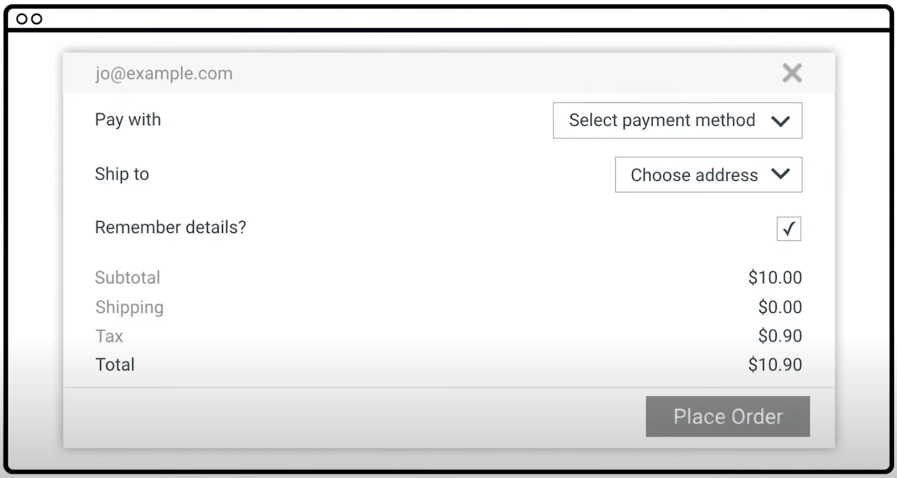
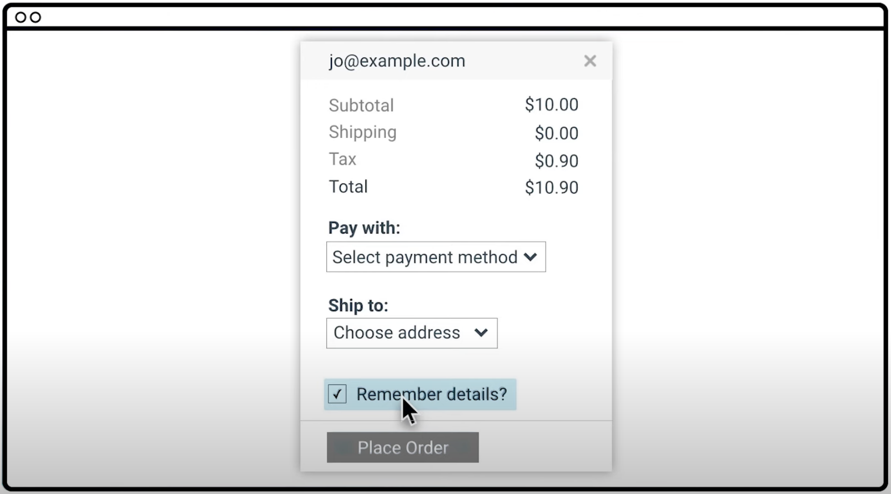

# Accessibility Overview

## 1. Introduction to Accessibility
- Understanding accessibility helps to create interfaces which are more delightful and easy to use for _everyone_
- It's about so much more than compliance and regulations
- There are plenty of misconceptions. A lot of developers feel that addressing accessibility will force them to choose between creating a delightful & attractive experience and ticking a box saying that their site is accessible.

### What do we mean by accessibility?
Broadly speaking: the goal is for a site's content to be available to everyone and for functionality to be operated by anyone; everyone should be able to access it.

As developers, it's easy to fall into the trap of assuming that all users can see and use a pointer interface (like a mouse or a touch screen) and experience your application the same way that you do. The experience you create might work for a narrow range of people, but can create issues for anyone outside of that range.

_Accessibility,_ then, prefers the experience of users who might be outside of that narrow range and who might access or experience things differently to the way the person we picture as a "typical user" would.

We will be exploring what happens when we take an inaccessible site and make it more accessible.

## 2. What is Accessibility?
_"Even though we centre our discussion of accessibility on users with impairments, we can all relate to the experience of using an interface which is not accessible to us."_

### Common accessibilty pitfalls include:
- Trying to access a desktop optimized site on a mobile device
- Trying to watch a video and seeing "This content is not available in your country."

_"In a broad sense, you've almost certainly experienced being unable to access something. As we mentioned, this class is largely concerned with accessibility in the narrow sense of ensuring users with disabilities can access content. However, addressing accesibility issues in the narrow sense very often improves the user experience for everyone."_

### An Example

#### Accessibility concerns include:
- Low contrast text for user email, subtotal, shipping, and tax, making it hard for low vision users to read.
- Difficult to associate labels with fields as the labels are on the far left and fields are on the far right of the modal. _It also makes it almost impossible for someone who needs to zoom in to use the page._ (!)
- Checkbox is not associated with its label; it is a separate component entirely. You would need to click a tiny checkbox as opposed to being able to click the whole label. This is also of particular concern when it comes to screen readers because it would be difficult to figure out the association.

### Fixing the Form

#### Accessibility fixes:
- The low contrast text is darker.
- Design is modified so that the labels are right next to the things they're labelling.
- We've fixed that label to be associated with the checkbox so now we can check and uncheck it by clicking anywhere on the label.

_"While we want to address accessibility first and foremost to avoid excluding people from accessing things, it certainly isn't a zero-sum game. We're more likely to make things better for everyone by addressing accessibility."_

## 3. Understanding the Diversity of Users

## 4. Diversity of Users (Broken Arm)

## 5. Diversity of Users (Blindness)

## 6. Diversity of Users (Audio)

## 7. Diversity of Users (Baby)

## 8. Diversity of Users (Concussion)

## 9. Diversity of Users (RSI)

## 10. Using a Screen Reader

## 11. Experiencing a Screen Reader

## 12. Checklists

## 13. Using WebAIM Checklist

## 14. Gear Shift into Course Practicalities